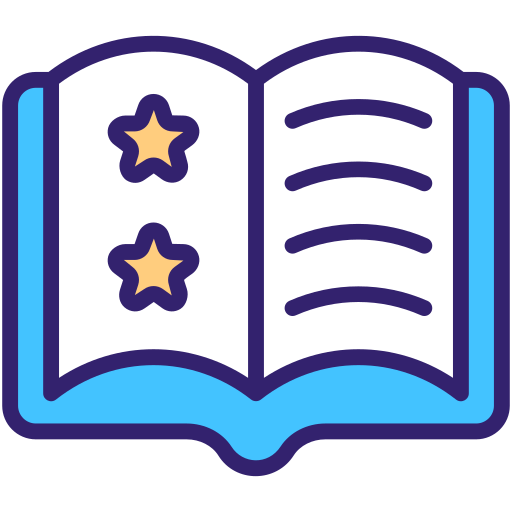

#   StoryCrafter - AI-Powered Story Generator

StoryCrafter is an innovative web application that uses Google's Gemini 1.5 Flash AI to generate custom stories based on your creative inputs. Simply provide keywords, mood, genre, and a story prompt, and watch as the AI crafts unique narratives tailored to your specifications.

## Features

- **AI-Powered Story Generation**: Powered by Google's Gemini 1.5 Flash
- **Customizable Inputs**: 
  - Genre selection (Fantasy, Sci-Fi, Mystery, etc.)
  - Mood selection (Whimsical, Suspenseful, Dark, etc.)
  - Keyword-based story elements
  - Story prompt customization
- **Advanced Analysis**:
  - Story theme and character analysis
  - Key element extraction (characters, locations, symbols)
  - Sequel hook generation
- **Flexible Output**:
  - Read directly in the app
  - Download as text file
- **Safety Controls**: Adjust content filters as needed

<br/><br/>

## Screenshots


<br/><br/>

## Setup and Installation

### Prerequisites
- Python 3.1+
- Streamlit account (optional, for cloud deployment)
- Google Gemini API key ([Get one here](https://aistudio.google.com/))

### Local Installation

1. Clone the repository:
```bash
git clone https://github.com/yourusername/storycrafter.git
cd storycrafter
```
2. Install dependencies:
```bash
pip install -r requirements.txt
```
3. Set up environment variables:
```bash
echo "GEMINI_API_KEY=your_api_key_here" > .env
```
4. Run the app:
```bash
streamlit run story_crafter.py
```

### Streamlit Cloud Deployment

1. Create a new repository from this template
2. Go to [Streamlit Community Cloud](https://share.streamlit.io/)
3. Click "New app" and connect your GitHub repository
4. Set the main file path to story_crafter.py
5. In app settings → Secrets, add:
```toml
GEMINI_API_KEY = "your_api_key_here"
```

<br/><br/>

## Configuration

### Environment Variables

- **_GEMINI_API_KEY_**: Your Google Gemini API key

### App Settings

- Adjust safety levels in the sidebar
- Control creativity with the temperature slider
- Toggle advanced features like story analysis and sequel hooks

### Usage Guide

1. Select your story genre and mood
2. Enter keywords (comma separated) that you want in your story
3. Provide a story prompt or starting point
4. Adjust creativity level using the slider
5. Click "Craft My Story"
6. Read, analyze, and download your generated story